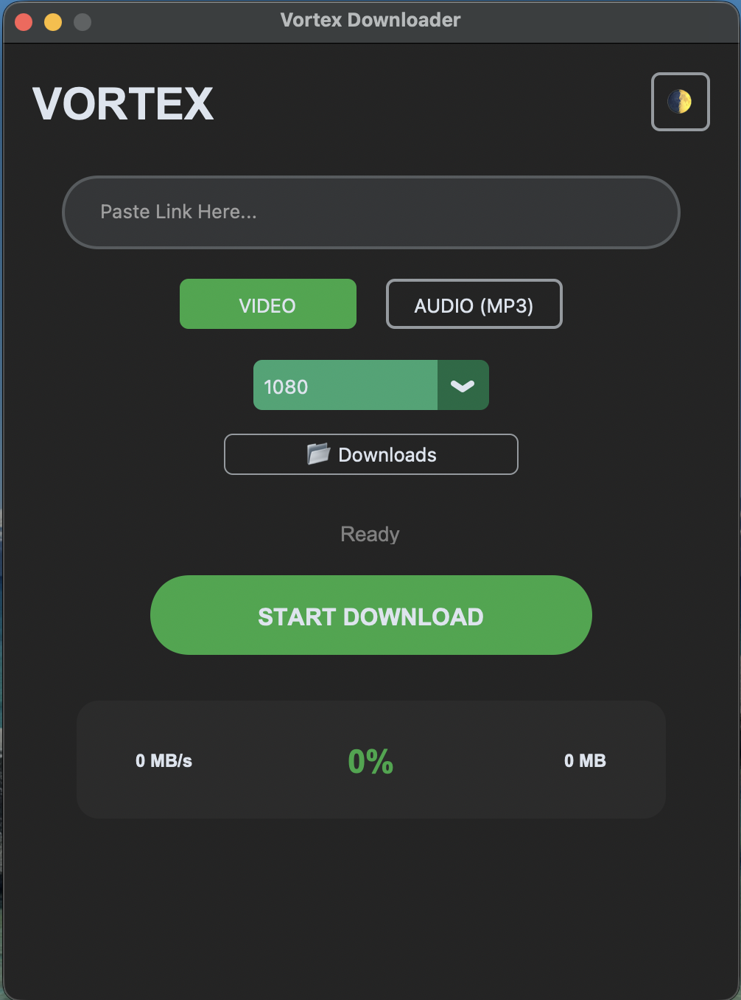
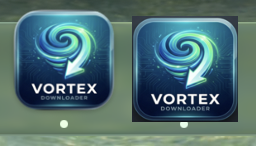

<div align="center">


# Vortex Downloader 🌀

**Fast. Secure. Private.**
<br>
*The ultimate tool to download video & audio from the web.*

[Report Bug](https://github.com/Xoner1/Vortex-Downloader/issues) · [Request Feature](https://github.com/Xoner1/Vortex-Downloader/issues)

</div>

---

## 📥 Download Latest Version

Get the standalone app for your system (No Python required).

| Platform | Download Link | Status |
| :--- | :--- | :--- |
| **Windows** 🪟 | **[Download .exe](https://github.com/Xoner1/Vortex-Downloader/actions/runs/20902701939/artifacts/5091878451)** | ✅ Tested (Win 10/11) |
| **macOS** 🍎 | **[Download .zip](https://github.com/Xoner1/Vortex-Downloader/actions/runs/20902701939/artifacts/5091877063)** | ✅ Tested (Intel & Silicon) |
| **Linux** 🐧 | **[Download Binary](https://github.com/Xoner1/Vortex-Downloader/actions/runs/20902701939/artifacts/5091876816)** | ✅ Tested (Ubuntu/Debian) |

> *Check the [Releases Page](https://github.com/Xoner1/Vortex-Downloader/releases) for older versions.*

---

## ✨ Why Vortex? (Key Features)

This isn't just another downloader. Vortex is built for quality and privacy.

* 🚀 **Hybrid Engine:** Smartly switches between **Direct Stream Copy** (Instant speed) and **Robust Conversion** (Maximum compatibility) to ensure every download works.
* 📺 **Universal Compatibility:** All videos are processed to **H.264/AAC**, ensuring they play on any device (iPhone, Smart TV, QuickTime) without needing VLC.
* 🔒 **Privacy First:** No tracking, no data collection, no external servers. Everything runs locally on your machine.
* 🎧 **Smart Audio:** Auto-extracts and converts audio to high-quality **MP3 (192kbps)**.
* ♾️ **Unlimited:** No daily limits, no paywalls. Open Source & Free.

---

## 📸 Screenshots

<div align="center">

### Clean Interface
*Simple, dark-themed UI designed for focus.*
<br>


<br><br>

### macOS Compatibility
*Note: Dual icons may appear briefly during processing on Mac.*
<br>


</div>

---

## 🛠️ Installation & Troubleshooting

### 🪟 Windows
1.  Download `Vortex-Windows.exe`.
2.  Double-click to run.
3.  *SmartScreen Warning?* Click **More Info** > **Run Anyway**.

### 🍎 macOS (Must Read)
Since I am an indie developer, the app is not signed by Apple. You need to allow it once.

**1. Move to Applications:**
Drag the `Vortex.app` to your `Applications` folder.

**2. Fix "Unidentified Developer":**
* **Method A (Settings):** Go to **System Settings** > **Privacy & Security** > Scroll down and click **"Open Anyway"**.
* **Method B (Terminal - Instant Fix):**
    ```bash
    sudo xattr -rd com.apple.quarantine /Applications/Vortex.app
    ```

### 🐧 Linux
Make the file executable and run it:
```bash
chmod +x Vortex-Linux
./Vortex-Linux


لقد قمت بإصلاح الملف بالكامل.

المشاكل التي قمت بحلها في هذا الكود:

إزالة تعارض الدمج: حذفت العلامات الغريبة (<<<<<<<, =======, >>>>>>>) التي كانت تسبب الفوضى.

ترتيب الأقسام: وضعت قسم "المميزات" (Key Features) قبل "التثبيت" ليكون التسلسل منطقياً.

إصلاح رابط صورة إنستغرام: الرابط الذي وضعته كان رابط بحث جوجل وليس رابط الصورة المباشر، لقد استبدلته برابط مباشر ليعمل الشعار.

إزالة التكرار: كان هناك نسختان من تعليمات التثبيت، أبقيت على النسخة الأفضل والأكثر تفصيلاً.

انسخ هذا الكود بالكامل واستبدل به كل ما هو موجود في ملف README.md:

Markdown

<div align="center">


# Vortex Downloader 🌀

**Fast. Secure. Private.**
<br>
*The ultimate tool to download video & audio from the web.*

[Report Bug](https://github.com/Xoner1/Vortex-Downloader/issues) · [Request Feature](https://github.com/Xoner1/Vortex-Downloader/issues)

</div>

---

## 📥 Download Latest Version

Get the standalone app for your system (No Python required).

| Platform | Download Link | Status |
| :--- | :--- | :--- |
| **Windows** 🪟 | **[Download .exe](https://github.com/Xoner1/Vortex-Downloader/actions/runs/20902701939/artifacts/5091878451)** | ✅ Tested (Win 10/11) |
| **macOS** 🍎 | **[Download .zip](https://github.com/Xoner1/Vortex-Downloader/actions/runs/20902701939/artifacts/5091877063)** | ✅ Tested (Intel & Silicon) |
| **Linux** 🐧 | **[Download Binary](https://github.com/Xoner1/Vortex-Downloader/actions/runs/20902701939/artifacts/5091876816)** | ✅ Tested (Ubuntu/Debian) |

> *Check the [Releases Page](https://github.com/Xoner1/Vortex-Downloader/releases) for older versions.*

---

## ✨ Why Vortex? (Key Features)

This isn't just another downloader. Vortex is built for quality and privacy.

* 🚀 **Hybrid Engine:** Smartly switches between **Direct Stream Copy** (Instant speed) and **Robust Conversion** (Maximum compatibility) to ensure every download works.
* 📺 **Universal Compatibility:** All videos are processed to **H.264/AAC**, ensuring they play on any device (iPhone, Smart TV, QuickTime) without needing VLC.
* 🔒 **Privacy First:** No tracking, no data collection, no external servers. Everything runs locally on your machine.
* 🎧 **Smart Audio:** Auto-extracts and converts audio to high-quality **MP3 (192kbps)**.
* ♾️ **Unlimited:** No daily limits, no paywalls. Open Source & Free.

---

## 📸 Screenshots

<div align="center">

### Clean Interface
*Simple, dark-themed UI designed for focus.*
<br>


<br><br>

### macOS Compatibility
*Note: Dual icons may appear briefly during processing on Mac.*
<br>


</div>

---

## 🛠️ Installation & Troubleshooting

### 🪟 Windows
1.  Download `Vortex-Windows.exe`.
2.  Double-click to run.
3.  *SmartScreen Warning?* Click **More Info** > **Run Anyway**.

### 🍎 macOS (Must Read)
Since I am an indie developer, the app is not signed by Apple. You need to allow it once.

**1. Move to Applications:**
Drag the `Vortex.app` to your `Applications` folder.

**2. Fix "Unidentified Developer":**
* **Method A (Settings):** Go to **System Settings** > **Privacy & Security** > Scroll down and click **"Open Anyway"**.
* **Method B (Terminal - Instant Fix):**
    ```bash
    sudo xattr -rd com.apple.quarantine /Applications/Vortex.app
    ```

### 🐧 Linux
Make the file executable and run it:
```bash
chmod +x Vortex-Linux
./Vortex-Linux 


📬 Feedback & Support
I am constantly working to improve Vortex. If you face any issues or have suggestions, feel free to reach out directly!

<div align="center">

<a href="https://www.instagram.com/fd_farhat?igsh=MXdvaW51dzZ0OWpoMQ=="> 


<b>Message me on Instagram (@fd_farhat)</b> </a>

</div>

📜 License
This project is open-source and available under the MIT License.