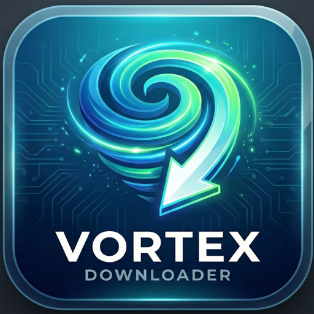

<div align="center">



# Vortex Downloader 🌀

**Fast. Secure. Universal.**
<br>
*Developed by Fakhr eddine Farhat (Xoner1)*
*Modern UI rebuilt with Flutter & FastAPI Backend*

*The ultimate tool to download video & audio from the web.*

[Report Bug](https://github.com/Xoner1/Vortex-Downloader/issues) · [Request Feature](https://github.com/Xoner1/Vortex-Downloader/issues)

</div>

---

## 🏗️ Architecture

Vortex has been completely rewritten using a modern stack:
- **Frontend**: A fast, responsive cross-platform UI built with **Flutter** (supports iOS, Android, and Desktop). Features include SponsorBlock, native Passcode Lock, Arabic localization, and background audio support.
- **Backend**: A Vercel-compatible cloud-native API server powered by **Python FastAPI** and **yt-dlp**. It extracts direct 4K streaming URLs without downloading files to the server.

## 📥 Getting Started (Development)

To run the application, you need to start both the Python backend and the Flutter frontend.

### 1. Backend Setup (FastAPI)

1. Navigate to the `backend` folder:
   ```bash
   cd backend
   ```
2. Install the required dependencies:
   ```bash
   pip install -r requirements.txt
   ```
3. Run the setup script to download FFmpeg:
   ```bash
   python get_ffmpeg.py
   ```
4. Start the backend server:
   ```bash
   uvicorn main:app --host 0.0.0.0 --port 8000
   ```
   The backend will start running on `http://localhost:8000`.

### 2. Frontend Setup (Flutter)

1. Make sure you have [Flutter installed](https://docs.flutter.dev/get-started/install).
2. Open a new terminal and navigate to the `frontend` folder:
   ```bash
   cd frontend
   ```
3. Install Flutter dependencies:
   ```bash
   flutter pub get
   ```
4. Run the desktop application (e.g., on macOS/Windows/Linux):
   ```bash
   flutter run -d macos  # Replace with windows or linux depending on your OS
   ```

---

## ✨ Why Vortex? (Key Features)

This isn't just another downloader. Vortex is built for quality and privacy.

* 🚀 **Cloud Streaming Engine:** Directly extracts and streams video/audio using caching, bypassing server-side downloads completely.
* 📺 **Universal Compatibility:** Stream up to 4K resolutions or choose 'Audio Only' mode.
* 🔒 **Privacy First:** Built-in Passcode Lock for your offline downloaded files.
* 🎧 **Background Audio:** Full support for minimizing the app and continuing playback (via Android WakeLocks and iOS/macOS Audio Session).
* ⏭️ **SponsorBlock Integration:** Automatically extracts chapter metadata.
* 🌍 **Multilingual:** Beautiful interface rendered natively in Arabic using Google Fonts Cairo.

---

## 📬 Feedback & Support

I am constantly working to improve Vortex. If you face any issues or have suggestions, feel free to reach out directly!

<div align="center">

<a href="https://www.instagram.com/fd_farhat?igsh=MXdvaW51dzZ0OWpoMQ==">

<br>
<b>Message me on Instagram (@fd_farhat)</b>
</a>

</div>

---

## 📜 License
This project is licensed under the MIT License - see the [LICENSE](LICENSE) file for details.
